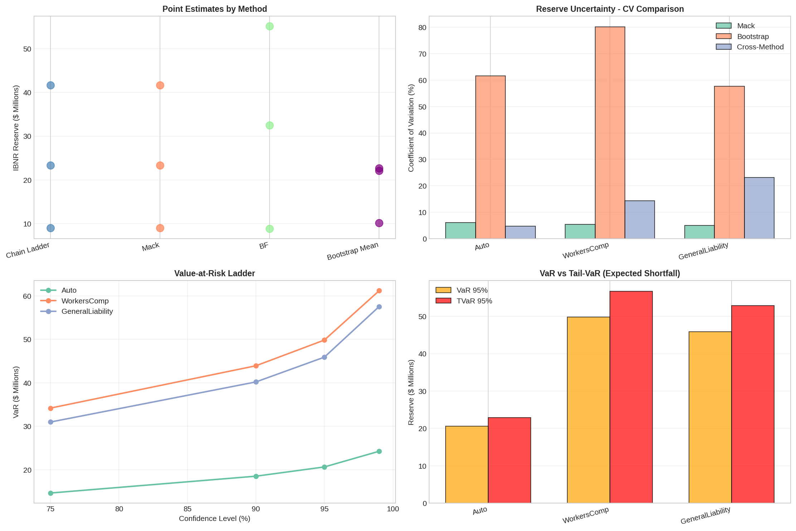
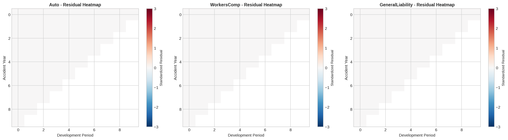

# Stochastic Reserving & Solvency II Engine 🛡️


## 📋 Executive Summary

Repository ini berisi **Actuarial Reserving Engine** berbasis Python untuk mengestimasi cadangan klaim (IBNR) dan mengukur risiko modal sesuai standar **Solvency II**.

Berbeda dengan pendekatan deterministik tradisional, engine ini menggunakan tiga metodologi statistik canggih—**Mack’s Method, Bootstrapping, dan GLM**—untuk menghasilkan distribusi penuh dari liabilitas asuransi, memungkinkan perhitungan metrik risiko ekor (*tail risk*) seperti VaR dan TVaR.

## 🚀 Key Features & Methodologies

Berdasarkan output simulasi, engine ini mencakup kapabilitas berikut:

### 1. Advanced Measurement Models
* **Mack’s Chain Ladder (Analytical):** Perhitungan *Mean Squared Error of Prediction* (MSEP) secara analitik untuk mengukur volatilitas cadangan tanpa simulasi.
* **ODP Bootstrapping (Stochastic):** Simulasi Monte Carlo (10.000 iterasi) menggunakan model *Over-Dispersed Poisson* untuk menghasilkan *confidence intervals* cadangan.
* **GLM Framework:** Pemodelan statistik formal menggunakan struktur *Generalized Linear Models* untuk validasi asumsi perkembangan klaim.

### 2. Solvency II & Risk Metrics
Engine ini secara otomatis menghitung metrik solvabilitas kunci:
* **Best Estimate Liability (BEL):** Estimasi cadangan sentral (Mean).
* **Risk Margin:** Dihitung berdasarkan *Cost of Capital* method.
* **Solvency Capital Requirement (SCR):** Berbasis VaR 99.5% (One-Year View).
* **Tail Value at Risk (TVaR):** Untuk analisis risiko ekstrem di atas persentil 99%.

### 3. Automated Reporting
Menghasilkan paket pelaporan lengkap:
* 📄 **Executive Report (TXT):** Ringkasan manajemen mengenai kecukupan cadangan.
* 📊 **Technical Report (JSON):** Data terstruktur untuk integrasi sistem lain.
* 📈 **Diagnostic Plots:** 10+ visualisasi termasuk *Residual Analysis*, *Heatmaps*, dan *Reserve Distribution*.

## 📊 Visual Analysis Samples

### Stochastic Reserve Distribution
Visualisasi ketidakpastian cadangan yang menunjukkan *range* kemungkinan pembayaran klaim di masa depan. Area merah menunjukkan *Capital Requirement*.



### Mack Residual Diagnostics
Plot residual standar untuk memvalidasi asumsi independensi antar tahun kejadian (*Accident Year*) dan tahun pengembangan (*Development Year*).



## 🛠️ Technical Methodology

| Component | Specification |
| :--- | :--- |
| **Bootstrapping** | Over-Dispersed Poisson (ODP) process on incremental claims. |
| **GLM Family** | Poisson / Gamma with Log-Link function. |
| **Optimization** | `scipy.optimize` & `statsmodels` for parameter fitting. |
| **Risk Measure** | VaR @ 99.5% (Solvency II Standard). |
| **Simulation** | 10,000 Iterations (Default). |

## 💻 Usage

1.  **Clone repository:**
    ```bash
    git clone [https://github.com/username/Stochastic-Reserving-Engine.git](https://github.com/username/Stochastic-Reserving-Engine.git)
    ```
2.  **Install dependencies:**
    ```bash
    pip install -r requirements.txt
    ```
3.  **Run the Analysis:**
    Jalankan notebook `stochastic_reserve.ipynb`. Laporan lengkap akan digenerate otomatis ke folder `output/reports/`.

## ⚠️ Disclaimer

Proyek ini dibuat untuk tujuan demonstrasi aktuaria dan riset. Meskipun menggunakan metode standar industri (Mack & Bootstrap), hasil estimasi untuk tujuan pelaporan keuangan riil harus divalidasi oleh *Qualified Actuary*.

---
*Part of the Actuarial Engineering Portfolio by [Nama Kamu]*
